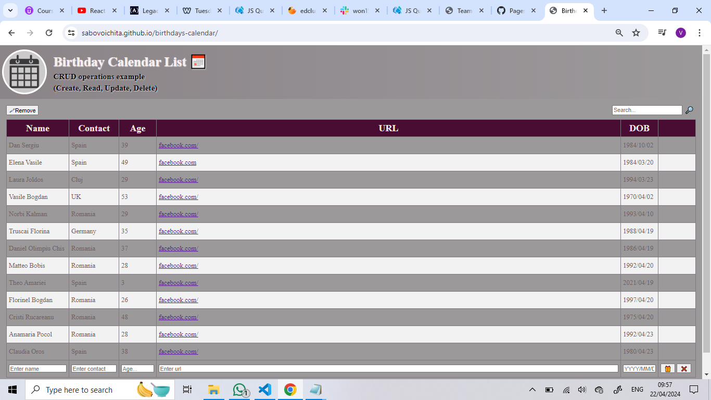

# 💌 Birthdays-Calendar-List

A Birthday Calendar List to store all important information (name, contact, age, url, DOB).

## 🎂 Features and Usage

- [x] Birthday Calendar List (CRUD\*) Operations

  - [x] **C**reate
  - [x] **R**ead
  - [x] **U**pdate
  - [x] **D**elete

- [ ] Search

- [ ] Loading Mask

- [ ] Sort & move input bar under thead

- [ ] display per month!

- [ ] Convert to React!

- [x] add live link!

## Live Preview

[✔🆗link](https://sabovoichita.github.io/birthdays-calendar/)



## ‼ Start (Daily usage)

Start node-API:

```sh
npm run api
```

start app(run in current project):

```sh
npm start
```

##📝Steps to create this project

## 📋 Steps to create this project

- [x] create **New repository** in [github/new](https://github.com/new)
  - [x] check Add a **README** file
  - [x] Add **.gitignore** (Node template)
- [x] **clone** it on your pc (follow Install guide)
- [x] create **index.html** file with standards
- [x] create **table** that represents final desing and structure (2 persons's birthdays as example)
  - [x] Table headers -> [Name, contact, age, DOB {github, linkedin, facebook}, url ]
  - [x] remove 2 example persons's birthdays and load them from js
  - [x] hint - TABLE -> THEAD & TBODY & TFOOT tags
- [ ] load birthdays.json and render them in page

## 🧩 Connect with API

Current app can connect with external [node-api-birthdays](https://github.com/sabovoichita/node-api-birthdays) to store it's data.

**Steps**

- [x] Clone & Start node-api
- [x] From current UI make request to node-api (using json or mysql url)

##⚙Install
-fork api
-api: [api](https://github.com/sabovoichita/node-api-birthdays)
git clone https://github.com/sabovoichita/node-api-birthdays.git
cd node-api-birthdays
npm install

-app:[app](https://github.com/sabovoichita/Birthdays-Calendar-List)
git clone https://github.com/sabovoichita/Birthdays-Calendar-List.git
cd Birthdays-Calendar-List
npm install

## JSon file as storage

-modify content to fit your needs

// GET birthdays-json
fetch("http://localhost:3000/birthdays-json", {
method: "GET",
headers: {
"Content-Type": "application/json"
}
});

// POST birthdays-json/create
fetch("http://localhost:3000/birthdays-json/create", {
method: "POST",
headers: {
"Content-Type": "application/json"
},
body: JSON.stringify({
name:"firstName lastName"
contact: "Country",
age: "number",
url: "https://www.google.com",
dob: "yyyy/mm/dd"
})
});

// DELETE birthdays-json/delete
fetch("http://localhost:3000/birthdays-json/create", {
method: "DELETE",
headers: {
"Content-Type": "application/json"
},
body: JSON.stringify({ id: "fedcba1610309909431" })
});

// PUT birthdays-json/update
fetch("http://localhost:3000/birthdays-json/update", {
method: "PUT",
headers: {
"Content-Type": "application/json"
},
body: JSON.stringify({
id: "fedcba1610310163146",
name:"firstName lastName"
contact: "Country",
age: "number",
url: "https://google.com",
dob: "yyyy/mm/dd"
})
});
